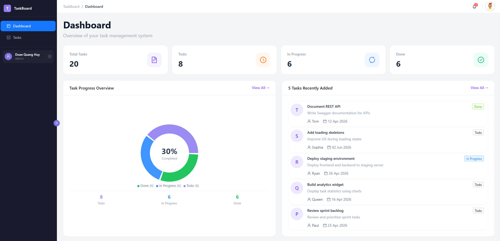
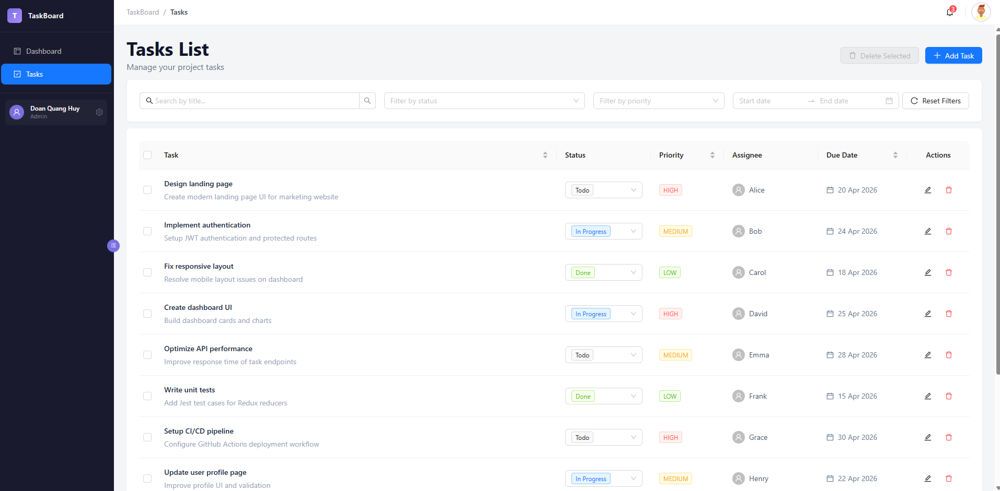

TaskBoard - Task Management System

1. Giới thiệu : 
    TaskBoard là ứng dụng quản lý công việc (Task Management) xây dựng bằng React + Redux Toolkit, 
    cho phép tạo, cập nhật, lọc và theo dõi tiến độ công việc với giao diện hiện đại và responsive.

2. Công nghệ, thư viện : 
    Công nghệ sử dụng : 
        React 18 + TypeScript 5 
        Redux Toolkit 2.x 
        Ant Design 5.x 
        Tailwind CSS 3.x
        Vite
    Các thư viện sử dụng thêm :
        React Router DOM (Dùng để quản lý routing giữa các trang)
        Recharts (vẽ biểu đồ trong dashboard để hiển thị thống kê task)
        Ant Design Icons

3. Tính năng : 
    3.1.Dashboard thống kê task
        -Tổng số task
        -Task theo trạng thái
        -Progress overview
        -Recent tasks list
    3.2.Quản lý Task
        -Tạo task mới
        -Chỉnh sửa task
        -Xoá task (single / multiple)
        -Cập nhật trạng thái
    3.3.Tìm kiếm & Lọc
        -Search theo tiêu đề (debounce 300ms)
        -Filter theo: Trạng thái (multi-select), Độ ưu tiên, Khoảng thời gian deadline

4. Cài đặt và chạy project
    Bước 1 : Mở terminal và Clone git project 
            git clone https://github.com/HuyDoan27/fe-test-DoanQuangHuy.git
    Bước 2 : cd taskboard
    Bước 3 : npm install
    Bước 4 : npm run dev

5. Các trang chính 
    5.1. Dashboard Page : 
    

    5.2. List Task
    